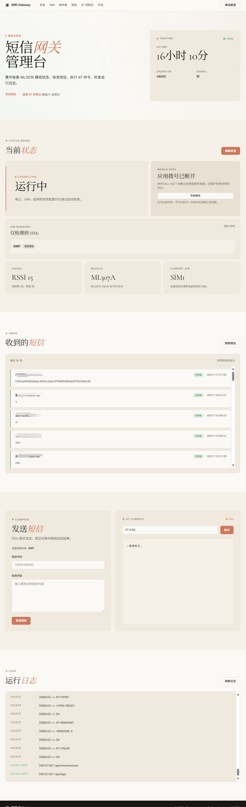

# SMS Forwarding

一个运行在 Node.js 上的 4G 短信网关。程序通过串口控制 4G 模组，接收 PDU 短信，合并长短信，并把短信转发到邮件、钉钉、飞书、Telegram、PushPlus、Server 酱、Bark 或自定义 Webhook。

项目同时提供 Web 管理台和 HTTP API，可用于查看模组状态、收件箱、日志、推送通道，发送短信，切换发送短信使用的 SIM，以及执行 AT 命令。

## 界面预览



## 功能

- 通过 AT 指令和 4G 模组通信
- 自动探测可用 AT 串口
- PDU 模式接收短信
- 长短信自动合并
- 收件箱持久化到本地文件
- 多推送通道转发短信
- Web 管理台
- Token 鉴权的 HTTP API
- Web/API 发送短信
- 双 SIM 状态识别和发送前切卡
- 移动数据开关和启动断网保护
- AT 命令调试入口

## 环境要求

- Node.js 18 或更高版本
- 可通过串口访问的 4G 模组
- 已插入可收发短信的 SIM 卡
- Linux 下通常需要访问 `/dev/ttyUSB*` 的权限

已主要围绕 ML307A 调试。其他 AT 指令兼容模组可以运行，但双卡、移动数据、URC 卡槽识别等能力取决于模组返回的指令结果。

## 快速启动

```bash
npm install
cp config.example.json config.json
```

编辑 `config.json`，至少确认：

```json
{
  "serial": {
    "path": "/dev/ttyUSB0",
    "baudRate": 115200,
    "autoDetect": true
  },
  "api": {
    "port": 3000,
    "webToken": "change-this-token"
  }
}
```

启动：

```bash
npm start
```

访问管理台：

```text
http://localhost:3000/admin
```

第一次访问会要求输入 `api.webToken`。也可以临时通过 URL 传入：

```text
http://localhost:3000/admin?token=change-this-token
```

## Docker 运行

先准备配置：

```bash
cp config.example.json config.json
```

然后启动：

```bash
docker compose up --build -d
```

查看日志：

```bash
docker compose logs -f sms-gateway
```

`docker-compose.yml` 会挂载：

- `./config.json:/app/config.json`
- `./logs:/app/logs`
- `./data:/app/data`
- `/dev:/dev`
- `/sys:/sys:ro`

默认端口是 `3000`。如需修改宿主机端口：

```bash
SMS_GATEWAY_PORT=8080 docker compose up -d
```

## PM2 运行

```bash
npm install
cp config.example.json config.json
pm2 start ecosystem.config.js
pm2 save
```

## 配置

`config.json` 必须存在，否则程序会退出。完整模板见 `config.example.json`。

### 必填项

| 配置项 | 说明 |
| --- | --- |
| `serial.path` | 串口路径。Linux 常见为 `/dev/ttyUSB0`，Windows 可写 `COM3`。`serial.autoDetect=true` 时它是优先探测项；`false` 时它就是实际打开的串口。 |
| `serial.baudRate` | 串口波特率，通常是 `115200`。 |
| `api.port` | Web 管理台和 HTTP API 监听端口。 |
| `api.webToken` | 唯一访问凭据。项目没有默认账号密码，也没有 `admin/admin123` Basic Auth。 |

### 可选项

| 配置项 | 默认值 | 说明 |
| --- | --- | --- |
| `serial.autoDetect` | `true` | 是否自动探测可响应 `AT` 的串口。 |
| `serial.probeTimeout` | `1200` | 单个串口探测超时，单位毫秒。 |
| `mobileData.cid` | `1` | 移动数据 PDP CID。有效范围 `1-15`，不要使用 `8`。 |
| `simCards` | `[]` | 只影响 Web 显示的 SIM 手机号或标签，不影响实际收发。`slot=0` 是 SIM1，`slot=1` 是 SIM2。 |
| `smtp` | 未启用 | 配置后会额外发送邮件通知。填写 `smtp.server` 后需要同时正确填写 `port`、`user`、`pass`、`sendTo`。 |
| `inbox.maxReceivedMessages` | `200` | 收件箱最多保留条数，代码上限是 `5000`。 |
| `inbox.receivedMessagesFile` | `data/received-messages.json` | 收件箱持久化文件。相对路径按项目根目录解析。 |
| `inbox.partitionBySim` | `true` | 查询收件箱时是否按 SIM 信息隔离。 |
| `inbox.allowAllSimMessages` | `false` | 是否允许显式查询全部 SIM 历史。 |
| `inbox.dualSimDefaultScope` | `all` | 双卡场景下默认收件箱范围，可选 `all` 或 `current`。 |
| `pushChannels` | `[]` | 推送通道列表。通道 `enabled=true` 时必须填写该类型要求的目标字段。 |

`api.webToken` 支持以下传入方式：

- `Authorization: Bearer <token>`
- `X-Web-Token: <token>`
- `?token=<token>`
- Web 管理台登录页

## 推送通道

支持的 `pushChannels[].type`：

| 类型 | 必填字段 |
| --- | --- |
| `dingtalk` | `url`，`secret` 可选 |
| `feishu` | `url`，`secret` 可选 |
| `telegram` | `url` 填 Bot Token，`key1` 填 Chat ID |
| `pushplus` | `key1` 填 PushPlus Token |
| `serverchan` | `key1` 填 Server 酱 SendKey |
| `bark` | `url` |
| `post_json` | `url` |
| `get` | `url` |
| `custom` | `url`，`customBody` 可选 |

`customBody` 必须是合法 JSON 字符串，支持以下占位符：

- `{sender}`
- `{message}`
- `{timestamp}`

`enabled=false` 的通道可以保留空字段；`enabled=true` 时会校验目标字段。

## SIM 行为

启动初始化时程序会探测 SIM 状态。运行期间的普通状态刷新不会为了探测卡槽而持续切换 SIM。

发送短信时使用当前绑定的发送 SIM。Web 管理台的切卡入口放在“发送短信”区域，切换会同时设置模组的 `SWITCHSIM` 和 `BINDSIM`，然后恢复短信直出配置。

短信接收使用 `CNMI` 直出模式。收到短信时，如果模组 URC 携带卡槽信息，会记录为 SIM1 或 SIM2；如果 URC 没有卡槽信息，收件箱会显示为未知 SIM。

如果只想给管理台显示手机号，可配置：

```json
{
  "simCards": [
    { "slot": 0, "phoneNumber": "+8613800138000" },
    { "slot": 1, "phoneNumber": "+447700900000" }
  ]
}
```

## HTTP API

所有 `/api/*` 接口都需要 token。下面示例使用 `X-Web-Token`：

```bash
TOKEN=change-this-token
BASE=http://localhost:3000
```

### 状态和日志

```bash
curl -H "X-Web-Token: $TOKEN" "$BASE/api/status"
curl -H "X-Web-Token: $TOKEN" "$BASE/api/modem/info"
curl -H "X-Web-Token: $TOKEN" "$BASE/api/modem/signal"
curl -H "X-Web-Token: $TOKEN" "$BASE/api/logs"
```

### 收件箱

```bash
curl -H "X-Web-Token: $TOKEN" "$BASE/api/sms/received?limit=50"
curl -H "X-Web-Token: $TOKEN" "$BASE/api/sms/received?limit=50&scope=current"
curl -H "X-Web-Token: $TOKEN" "$BASE/api/sms/received?limit=50&simSlot=0"
curl -H "X-Web-Token: $TOKEN" "$BASE/api/sms/received?limit=50&simSlot=1"
```

### 发送短信

```bash
curl -X POST "$BASE/api/sms/send" \
  -H "Content-Type: application/json" \
  -H "X-Web-Token: $TOKEN" \
  -d '{"phone":"13800138000","message":"测试短信"}'
```

### SIM 状态和切换

```bash
curl -H "X-Web-Token: $TOKEN" "$BASE/api/modem/sim"

curl -X POST "$BASE/api/modem/sim/switch" \
  -H "Content-Type: application/json" \
  -H "X-Web-Token: $TOKEN" \
  -d '{"slot":1}'
```

`slot=0` 表示 SIM1，`slot=1` 表示 SIM2。

### 移动数据

```bash
curl -H "X-Web-Token: $TOKEN" "$BASE/api/modem/mobile-data"

curl -X POST "$BASE/api/modem/mobile-data" \
  -H "Content-Type: application/json" \
  -H "X-Web-Token: $TOKEN" \
  -d '{"enabled":false}'

curl -X POST "$BASE/api/modem/mobile-data/consume" \
  -H "Content-Type: application/json" \
  -H "X-Web-Token: $TOKEN" \
  -d '{"target":"8.8.8.8"}'
```

### AT 命令

```bash
curl -X POST "$BASE/api/modem/at" \
  -H "Content-Type: application/json" \
  -H "X-Web-Token: $TOKEN" \
  -d '{"command":"AT+CSQ"}'
```

### 推送通道管理

```bash
curl -H "X-Web-Token: $TOKEN" "$BASE/api/push/channels"

curl -X PUT "$BASE/api/push/channels" \
  -H "Content-Type: application/json" \
  -H "X-Web-Token: $TOKEN" \
  -d '{"channels":[]}'

curl -X POST "$BASE/api/push/test" \
  -H "Content-Type: application/json" \
  -H "X-Web-Token: $TOKEN" \
  -d '{"enabled":true,"type":"post_json","name":"测试","url":"https://example.com/webhook"}'
```

## 目录结构

```text
.
├── src/
│   ├── index.js      # 程序入口
│   ├── modem.js      # 串口、AT 指令、SIM 和移动数据控制
│   ├── sms.js        # PDU 解析、长短信处理后的转发、收件箱记录
│   ├── concat.js     # 长短信分段合并
│   ├── push.js       # 推送通道
│   ├── api.js        # Web 管理台和 HTTP API
│   └── logger.js     # 日志
├── public/           # Web 管理台静态文件
├── data/             # 收件箱持久化数据
├── logs/             # 运行日志
├── config.example.json
├── config.json       # 本地配置，不应提交
├── docker-compose.yml
├── Dockerfile
└── ecosystem.config.js
```

## 常见问题

### 串口打不开

Linux 下先确认设备存在：

```bash
ls -l /dev/ttyUSB*
```

如果是权限问题，把运行用户加入串口权限组，重新登录后生效：

```bash
sudo usermod -a -G dialout "$USER"
```

Docker 场景下确认 `docker-compose.yml` 已挂载 `/dev`，并保留了 `device_cgroup_rules`。

### 自动探测不到模组

- 确认 USB 连接和供电。
- 确认 `serial.baudRate` 正确。
- 临时关闭自动探测，把 `serial.autoDetect` 设为 `false`，并把 `serial.path` 写成真实 AT 串口。
- 查看日志中每个候选串口的探测结果。

### ML307A 首次上电被识别成网卡

ML307A 首次上电或恢复默认 USB 模式时，系统可能先把它识别为 RNDIS 网卡，而不是 USB 串口。此时 `lsusb` 能看到设备，但 `/dev/ttyUSB*` 里找不到可用 AT 串口。

可以用下面命令确认 USB 设备和内核识别结果：

```bash
lsusb
dmesg | grep -E 'ML307A|2ecc|3012|rndis|ttyUSB'
```

典型日志会包含类似内容：

```text
usb 1-3: New USB device found, idVendor=2ecc, idProduct=3012
usb 1-3: Product: ML307A
usb 1-3: Manufacturer: CMIOT
rndis_host 1-3:1.0: rndis media connect
rndis_host 1-3:1.0 enxac0c29a39b6d: renamed from eth0
```

如果出现上述 RNDIS 网卡日志，并且系统没有生成 USB 串口，可以把该 USB ID 添加到 `option` 串口驱动：

```bash
sudo modprobe option
echo 2ecc 3012 | sudo tee /sys/bus/usb-serial/drivers/option1/new_id
```

执行后重新查看 `/dev/ttyUSB*`，再把 `config.json` 里的 `serial.path` 指向实际 AT 串口。不同内核、发行版或模组固件的枚举行为可能不完全一致；如果后续仍会被识别为网卡，可按系统发行版方式配置 udev/modprobe 规则。

### 收不到短信

- 确认 SIM 卡已插好且可以注册网络。
- 查看 `/api/status` 里的 `ready`、`operator`、`signal`。
- 确认日志里有 `PDU模式设置完成` 和 `CNMI参数设置完成`。
- 部分模组不会在 URC 里带卡槽信息，这只影响收件箱显示的 SIM 归属，不代表短信没有收到。

### 发送短信失败

- 先在管理台确认当前发送 SIM。
- 确认目标号码格式正确。
- 查看日志里的 AT 响应。
- 如果刚切换 SIM，等待模组重新注册网络后再发。

## 安全说明

- 不要提交 `config.json`、token、手机号、Webhook URL、SMTP 密码和日志。
- 管理台和 API 只使用 `api.webToken` 鉴权。
- `POST /api/modem/at` 可以执行任意 AT 命令，只应暴露在可信网络内。

## License

MIT
